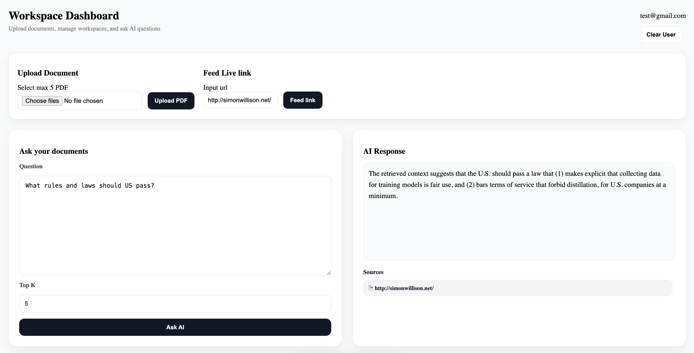
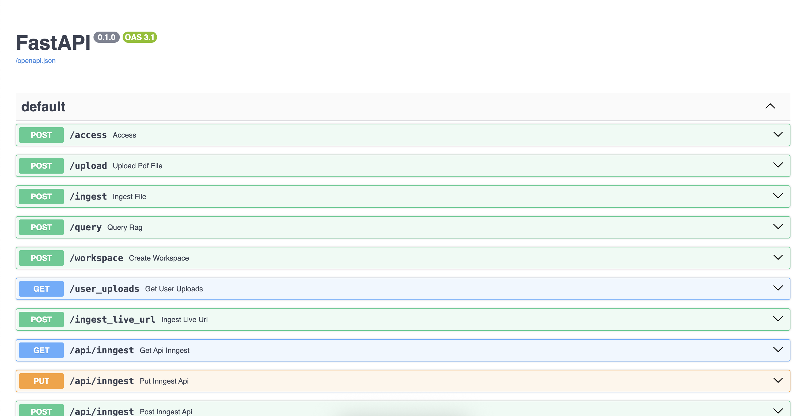
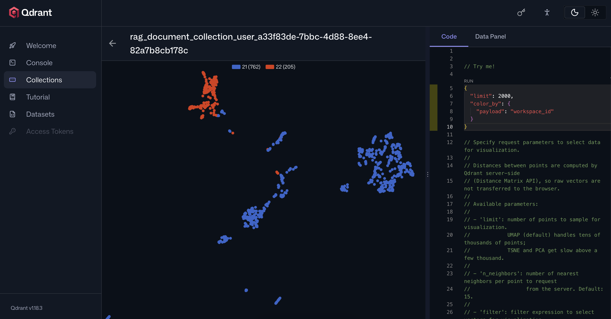
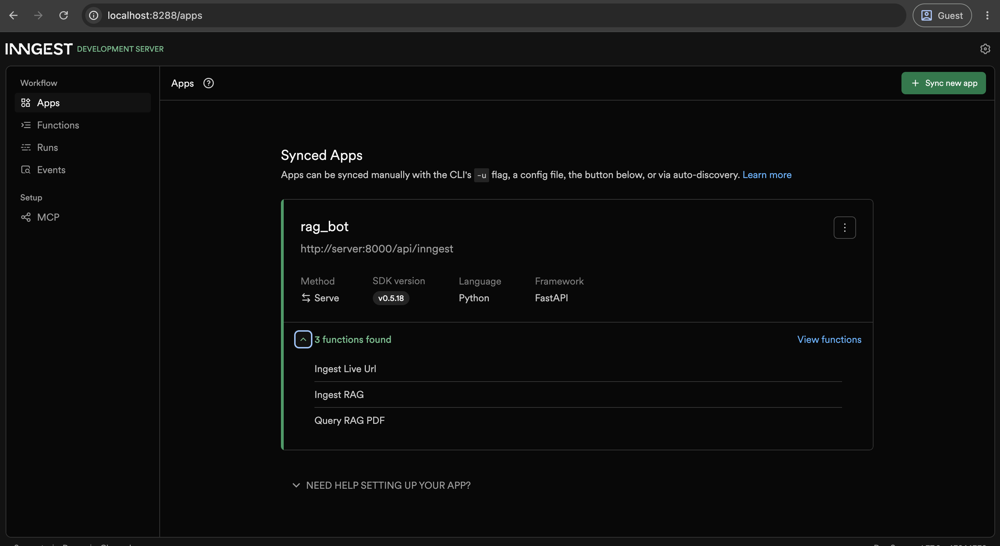

# RagDoc

A simple Retrieval-Augmented Generation (RAG) application that lets you ingest documents and web pages, index them into a vector database, and perform semantic search.

## Features

- 📄 Upload and process documents (PDFs only)
- 🌐 Extract content from web pages
- 🔍 Semantic search with Qdrant
- ⚡ FastAPI backend
- ⚛️ React + Vite frontend
- 🗄️ PostgreSQL (pgvector)
- 🔄 Background jobs powered by Inngest

## Tech Stack

### Frontend
- React
- Vite

### Backend
- FastAPI
- LlamaIndex
- Qdrant
- PostgreSQL (pgvector)
- Inngest

### LLM
- Ollama LLM & embedding

## Project Structure

```text
.
├── client/              # React + Vite frontend
├── server/              # FastAPI backend
├── screenshots/         # Project screenshots
└── compose.yml
```

## Getting Started

### Prerequisites

- Docker
- Docker Compose

### Run the project

```bash
docker compose up --build
```

After the containers start, the following services will be available:

| Service | URL |
|---------|-----|
| Frontend | http://localhost:5173 |
| FastAPI API | http://localhost:8000 |
| Swagger UI | http://localhost:8000/docs |
| Qdrant Dashboard | http://localhost:6333/dashboard |
| Inngest Dev Server | http://localhost:8288 |

---

## Screenshots

### Frontend



---

### FastAPI Swagger



---

### Qdrant Dashboard



---

### Inngest



---

## Demo

The repository includes a demo video:

- `screenshots/demo.mp4`

## Setup

1. Setup and run locally
- Setup Ollama : `curl -fsSL https://ollama.com/install.sh | sh`
    - Pull one of both models, I preferred qwen3:latest and nomic-embed-text-v2-moe
    - llama:3b
    - qwen3:latest
    - nomic-embed-text-v2-moe or nomic-embed-text:latest 
- Setup Docker : `https://docs.docker.com/compose/install/`
- Create .env files with following content


./.env
```
API_URL = "http://server:8000/api/inngest"
POSTGRES_USER = postgres
OSTGRES_PASSWORD = postgres
POSTGRES_DB = rag_bot

```

./server/.env

```
OLLAMA_API_URL = 'http://host.docker.internal:11434'
QDRANT_URL = "http://qdrant:6333"
INGGEST_API_URL= "http://inngest:8288/v1"
INNGEST_BASE_URL="http://inngest:8288"
INNGEST_DEV=1
POSTGRES_USER= postgres
POSTGRES_PASSWORD= postgres
POSTGRES_DB=rag_bot

```

./client/.env

```
VITE_API_URL = 'http://localhost:8000'
```